# Personalized-Products-Recommendation-Model

## Description
  This project builds a smart recommendation system for an e-commerce website. It uses data from user actions like what they view, add to their cart, and purchase to suggest products they might like.
  By analyzing user interactions, we create an interaction matrix and use a method called Alternating Least Squares (ALS)  which is an approach to Collaborative Filtering to recommend products that each user is most likely to be interested in, that is Personalized Product Suggestions. 

## Objective
The objectives of the project work are as -
- To Enhance User Experience.
- To Increase Sales and Revenue.
- To Improve Customer Retention and Loyalty.
- To understand User Preferences and Trends.

## Dataset Info.
### File Structure
- Rows : 66589268 (above 6.5 crore)
- Column : 10

| Property | Description |
| :---         | :---         |
| event_time | Time when event happened at (in UTC). |
| event_type | Only one kind of event: purchase. |
| product_id | ID of a product |
| category_id	| Product's category ID |
| category_code	| Product's category taxonomy (code name) if it was possible to make it. Usually present for meaningful categories and skipped for different kinds of accessories. |
| brand |	Downcased string of brand name. Can be missed. |
| price	| Float price of a product. Present. |
| user_id |	Permanent user ID. |
| ** user_session** |	Temporary user's session ID. Same for each user's session. Is changed every time user come back to online store from a long pause. |

## Architecture

## Methodology:
1. Raw Data:
o The process begins with raw, unprocessed data. This could be anything from user interactions on a website (clicks, purchases, ratings) to sensor data from IoT devices.

3. Transformation & Actions (Using PySpark):
o The raw data undergoes transformation using PySpark, a powerful tool for large-scale data processing.
o This step involves cleaning, aggregating, and structuring the data to make it suitable for analysis.

5. Exploratory Data Analysis (EDA):
o The upper path in the workflow leads to EDA. Here, data scientists explore the cleaned data to uncover patterns, correlations, and potential insights.
o Techniques like data visualization, statistical summaries, and feature engineering are used.

7. Clean & Modified Data:
o The cleaned and modified data (resulting from EDA) moves forward. It’s now in a more usable format for subsequent steps.

9. Recommendation (Alternating Least Squares - ALS):
o The lower path focuses on recommendation. ALS is an algorithm commonly used for collaborative filtering in recommendation systems.
o ALS predicts missing entries in a user-item interaction matrix, enabling personalized recommendations.

6. MySQL Database:
o The processed data is stored in a MySQL database. This step ensures persistence and efficient retrieval for future use.

8. Visualization (Using Tableau):
o Finally, the workflow culminates in visualization. Tableau, a popular data visualization tool, is employed to create interactive dashboards.
o These dashboards allow users to explore insights, trends, and recommendations visually.

This workflow takes raw data, transforms it, analyzes it, generates recommendations, stores it in a database, and presents visual insights.

## Cleaning & Transformation 

### Original Data

### Cleaning Of Data

### Processing and Transformation Of Data 

## Custmoer Revenue Analysis 
### Sum Of Users Over The Month
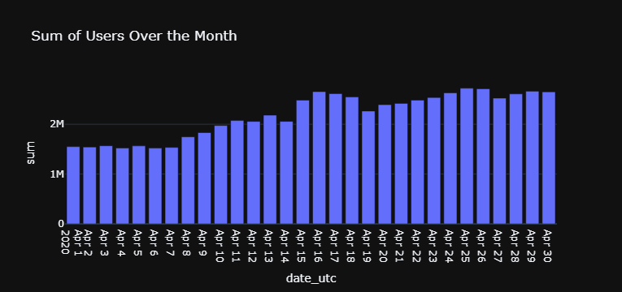

### Average User Count by Day
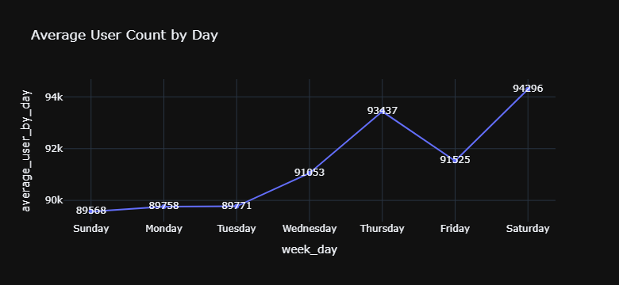

### Revenue Over The Month
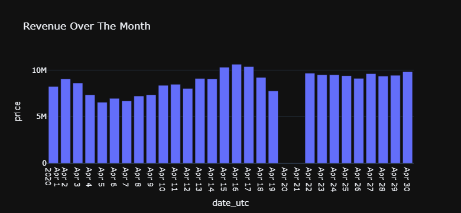

### Average Revenue Over Day Of Week
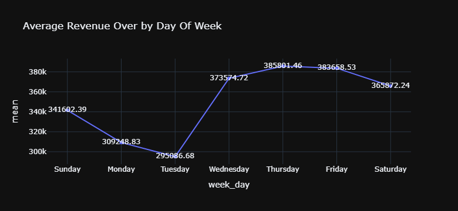

### Average Purchase Activity Over The Hour
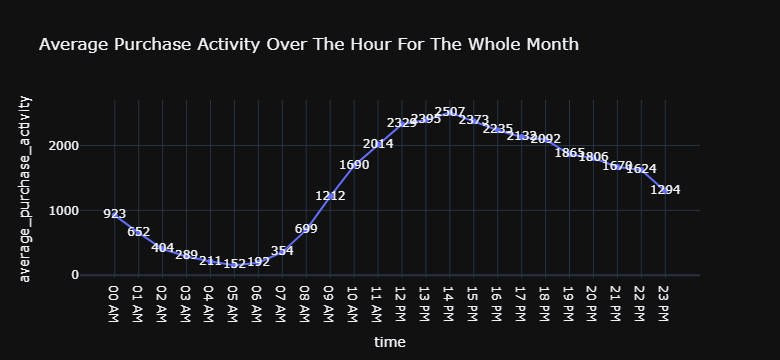

### Top 10 Brands In Terms Of Revenue
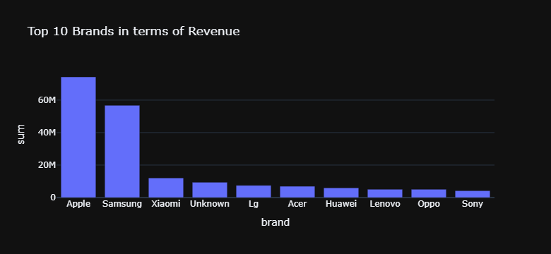

### Top 10 Brands In Terms Of Purchase Count
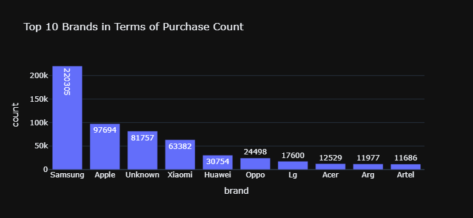

### Top 10 Customers Via Amount Spent
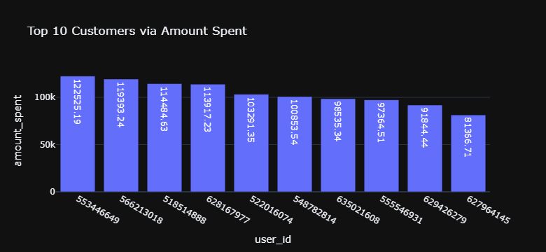

##  Recommendation (Alternating Least Squares - ALS)
### ALS Algorithm
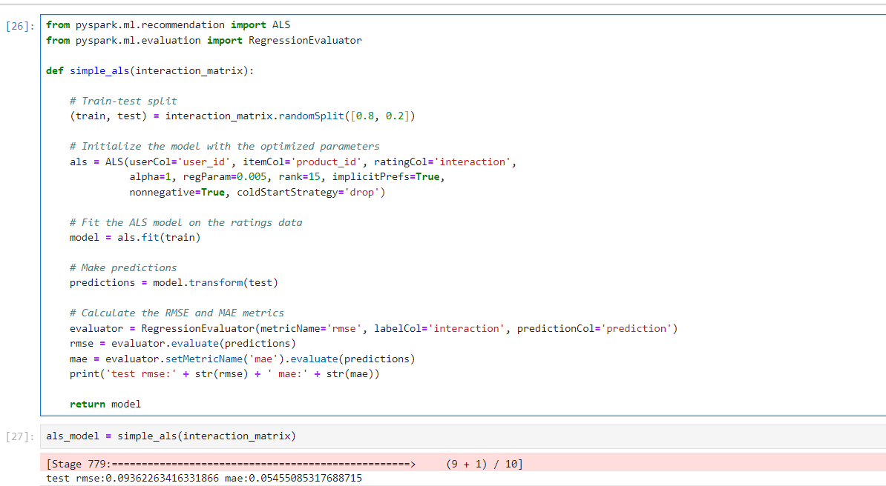

### Recommend Product for Users
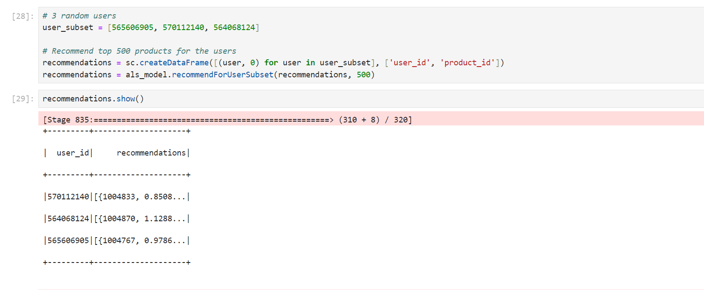

## Visualization Using Tableau
### Dynamic Dashboard
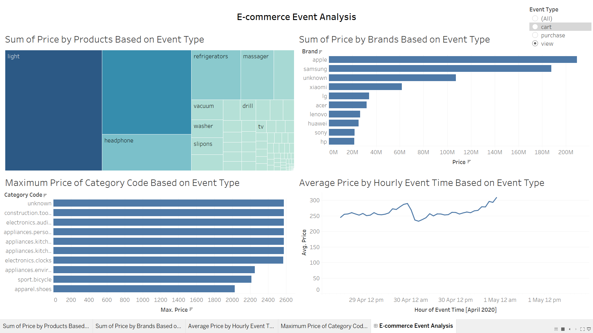
